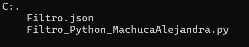
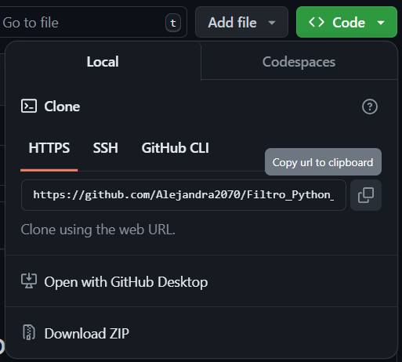
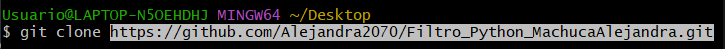
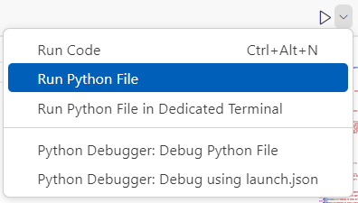

# FILTRO PYTHON

Realización de un programa como trabajo de filtro.

# Descripción

Este programa contiene dos archivos que son:
- Un archivo [.py] utilizado para la creación del código.

- Un archivo [.json] para importar la información necesaria del proyecto.

# Tecnologías utilizadas

- >Python
- >JSON

# Estructura del proyecto

En estos archivos se puede encontrar la información y el código utilizados para la realización del proyecto de filtro.

# Características
| Nombre        |Descripción |
|--|--|
| Archivo [.py] | Este contiene todo el código utilizado|
| Archivo [.json] | Se encuentra toda la información de los usuarios, categorias, servicios, etc.|

# Instrucciones

1. >Copiar el enlace del repositorio.

2. >Clonar el repositorio. 

3. >Abrir el archivo [.py]

# Desarrollado por:

>El proyecto de filtro del módulo Python fue desarrollado por Alejandra Machuca Molina, estudiante de CampusLands.